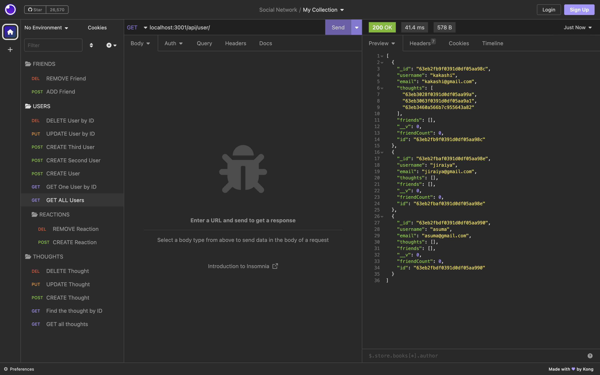

# NoSQL-Challenge-Social-Network-API
HW CHALLENGE #18

## Description
Our challenge for this assignment is to build an API for a social network web application where users can share their thoughts, react to friends’ thoughts, and create a friend list. We are to use Express.js for routing, a MongoDB database, and the Mongoose ODM. In addtion to using Express.js and Mongoose packages, we also had the option to use a Javascript date library of our choice or the native Javascript `Date` object to format timestamps. [click here](https://github.com/hannybear88/NoSQL-Challenge-Social-Network-API)to see my code for this project.

## Table of Contents
* [Installation](#installation)
* [Tests](#Tests)
* [Getting Started](#Getting-Started)
* [User Story](#User-Story)
* [Acceptance Criteria](#Acceptance-Criteria)
* [Usage](#Usage)
* [Demo](#Demo)
* [Technologies Used](#Technologies-Used)
* [Support](#Support)
* [Credits](#Credits)
* [Contributors](#Contributors)


## Installation
1. Clone the repo
2. Install all dependencies 
    - `npm init -y`
    - `npm` install 
3. Start the server 
4.   - `npm` start

5. Open Insomnia Core to test API routes


## Tests
Testing restful API calls with Insomnia Core
[click here](https://docs.insomnia.rest/insomnia/install) to install Insomnia


## Getting Started 
Use the following guidelines to set up your models and API routes
### Models 
#### User 
- `username`
    - String
    - Unique
    - Required 
    - Trimmed
- `email`
    - String
    - Required
    - Unique
    - Must match a valid email address (look into Mongoose's matching validation)
- `thoughts`
    - Arry of `_id` values referencing the `Thought` model
- `friends` 
    - Arry of `_id` values referencing the `User` model (self-reference)
#### Schema Settings 
Create a virtual called `friendCount` that retrieves the length of the user's `friends` array field of query. 


#### Thought 
- `thoughtText` 
    - String
    - Required
    - Must be between 1 and 280 characters
- `createdAt` 
    - Date
    - Set default value to the current timestamp
    - User a getter method to format time the timestamp on query 
- `username` (The uesr that created this thought)
    - String
    - Required
- `reactions` (These are like replies)
    - Array of nested documents created with `reactionSchema`
#### Schema Settings 
Create a virtual called `reactionCount` that retrieves the length of the thought's `reactions` array field of query. 


### Reaction (SCHEMA ONLY)
- `reactionId` 
    - Use Mongoose's ObjectId data type
    - Default value is set to new ObjectId
- `reactionBody`
    - String
    - Required
    - 280 character maximum 
- `username` 
    - String
    - Required
- `createdAt` 
    - Date
    - Set default value to the current timestamp
    - Use a getter method to format the timestamp on query
#### Schema Settings
This will not be a model, but rather will be used as a `reaction` field's subdocument schema in the `Thought` model


### API Routes
`/api/users`
-  `GET` all users
-  `GET` a single user by its `_id` and populated thought and friend data 
-  `POST` a new user: 
    `````
    //example data 
    { "username": "lernantino", 
    "email": "lernantino@gmail.com
    }
    `````
-  `PUT` to update a user by its `_id` .         
-  `DELETE` to remove a user by its `_id`

#### BONUS: Remove a user's associated thoughts when deleted. 

`/api/users/:userId/friends/:friendId`
- `POST` to add a new friend to a user's friend list
-  `DELETE` to remove a friend from a user's friend list
`/api/thoughts`
-  `GET` to get all thoughts
-   `GET` to get a single thoughts by its `_id`
-   `POST` to create a new thought (don't forget to push the created thought's `_id` to the associated user's `thoughts` array field)
    `````
    // example data
    {
        "thoughtText": "Here's a cool thought...",
        "username": "lernatino",
        "userId": "5edff358a0fcb779aa7b118b"
    }
    `````
-   `PUT` to update a thought by its `_id`
-  `DELETE` to remove a thought by its `_id`

`/api/thoughts/:thoughtId/reactions`

-  `POST` to create a reaction stored in single thought's `reaction` array field
-   `DELETE` to pull and remove a reaction by the reaction's `reactionId` value


## User Story
- AS A social media startup
- I WANT an API for my social network that uses a NoSQL database
- SO THAT my website can handle large amounts of unstructured data

## Acceptance Criteria
- GIVEN a social network API
- WHEN I enter the command to invoke the application
- THEN my server is started and the Mongoose models are synced to the MongoDB database
- WHEN I open API GET routes in Insomnia for users and thoughts
- THEN the data for each of these routes is displayed in a formatted JSON
- WHEN I test API POST, PUT, and DELETE routes in Insomnia
- THEN I am able to successfully create, update, and delete users and thoughts in my database
- WHEN I test API POST and DELETE routes in Insomnia
- THEN I am able to successfully create and delete reactions to thoughts and add and remove friends to a user’s friend list

## Usage
`npm` start

------------------------

* USERS
    * GET all users
        *  localhost:3001/api/user/
    * GET One User by id
        * GET http://localhost:3001/api/user/:id
    * CREATE User
        * POST http://localhost:3001/api/user
        * The JSON body request should look like below: 
        `````
            {
	            "username": "asuma",
                "email": "asuma@gmail.com"
            }
        `````
    * UPDATE User by id
        * PUT http://localhost:3001/api/user/:id
        * The JSON body request should look like below: 
        `````
            {
	            "username": "asuma1",
                "email": "asuma@gmail.com"

            }
        ``````
    * DELETE User by id
        * DELETE http://localhost:3001/api/user/:id

* THOUGHTS
    * GET all products
        * GET localhost:3001/api/thought
    * GET one product by id
        * GET localhost:3001/api/thought/:id
    * CREATE new product
        * POST localhost:3001/api/thought
        * The JSON body request should look like below: 
        `````
	        {
                "thoughtText": "those who leave their friends are worse than scum",
                "username": "kakashi",
                "userId": "63e2ef48db8f76f58b233cff"
            }
        `````
    * UPDATE product by id
        * PUT localhost:3001/api/thought/:id
        * The JSON body request should look like below: 
        `````
        {
	        "thoughtText": "Hi..."
        }
        `````
        * DELETE products by id
            * DELETE localhost:3001/api/thought/:id
* REACTIONS
    * CREATE new reaction
        * POST http://localhost:3001/api/thoughts/:thoughtId/reactions
        * The JSON body request should look like below: 
        `````
       {
	        "reactionBody": "Hello Team 7",
	        "username": "jiraiya"
        }
        `````
    * REMOVE reaction
        * DELETE http://localhost:3001/api/thoughts/:thoughtId/reactions/:id
* FRIENDS
    * CREATE new Friend
        * POST http://localhost:3001/api/thoughts/:thoughtId/reactions

    * REMOVE Friend
        * DELETE http://localhost:3001/api/thoughts/:thoughtId/reactions/:id
## Demo

Walkthrough Video

Please [click here](https://youtu.be/quTTcE4KK0w) for a walkthrough video that demonstrates the application's functionality.


Screenshots





## Technologies Used


 
 


## Support
If you need support or have any questions about the repo, please [open an issue](https://github.com/hannybear88/Model-View-Controller--MVC--Challenge-Tech-Blog/issues) or contact me via email at hannahkchung88@gmail.com. You can find more of my work on my GitHub, [hannybear88](https://github.com/hannybear88/).


## Credits
- Code by Hannah Chung


## Contributors
- Code by Hannah Chung